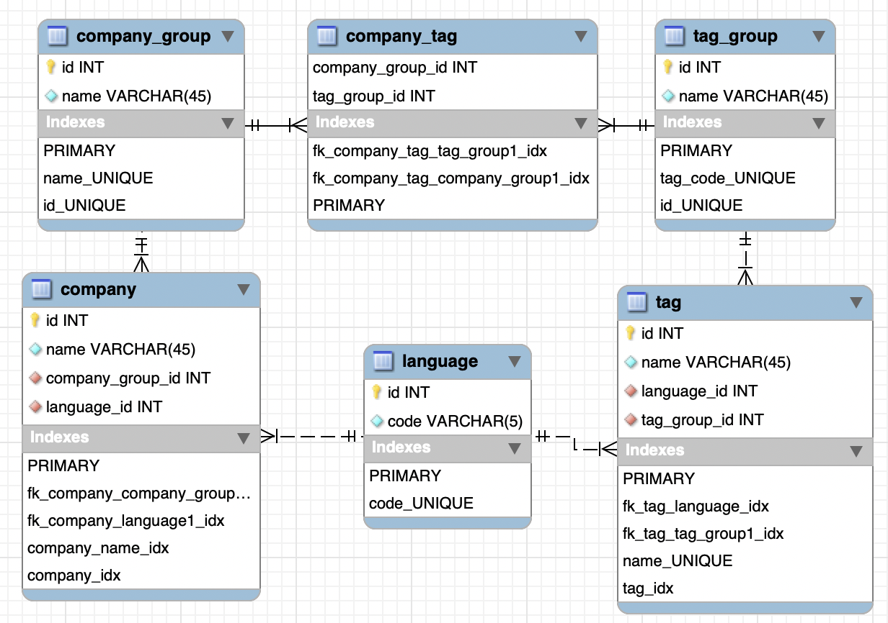

# DB Modeling

데이터베이스는 MySQL을 활용하였으며, `5.7.29` 버전 기반이다.

데이터베이스 이름은 `company_info`라고 정했으며, 생성 쿼리는 다음과 같다.

```mysql
CREATE DATABASE company_info DEFAULT CHARACTER SET utf8 COLLATE utf8_unicode_ci;
```

각 테이블에 대한 설명은 다음과 같다.

#### 1. `language`
언어 정보를 담는 테이블. 각 필드별 설명은 다음과 같다.
```
id: 언어 ID. 기본키이며 auto_increment 방식이다.
code: 언어 코드. 최대 5자로 구성되어 있으며 한국어는 'kr', 영어는 'en', 일본어는 'jp' 등으로 저장된다.
```

#### 2. `company_group`
회사 그룹 정보를 담는 테이블. `company` 테이블과 다르게 여기에는 서로 다른 언어로 저장된 같은 회사를 식별하기 위한 회사 그룹별 고유 ID가 저장된다. 각 필드별 설명은 다음과 같다.
```
id: 각 회사별 고유의 ID. 기본키이며 auto_increment 방식이다.
name: 각 회사 그룹명.
```

#### 3. `company`
각 언어별 회사명 정보를 담는 테이블. 각 필드별 설명은 다음과 같다.
```
id: 회사 ID. 기본키이며 auto_increment 방식이다.
name: 회사 이름
language_id: 언어 ID. 외래키이며 회사명이 어떤 언어로 되어 있는지 알려줌.
company_group_id: 회사 그룹 ID. 외래키이며 이를 통해 이 언어로 된 회사명이 어떤 회사를 가리키는 것인지 알게 해줌.
```
``
**한편, 회사 이름을 부분적으로 입력해도 검색이 되도록 하기 위하여 NGRAM 파서 FULLTEXT 인덱스를 걸었다.**

#### 4. `tag_group`
태그 그룹 정보를 담는 테이블. `tag` 테이블과 다르게 여기에는 서로 다른 언어로 저장된 같은 태그를 식별하기 위한 태그 그룹별 고유 ID가 저장된다. 각 필드별 설명은 다음과 같다.
```
id: 태그 그룹 ID. 기본키이며 auto_increment 방식이다.
name: 태그 그룹명.
company_group_id: 회사 그룹 ID. 외래키이며 이를 통해 어떤 회사가 어떤 태그를 갖고 있는지 식별해줌.
```

#### 5. `tag`
각 언어별 태그 정보를 담는 테이블. 각 필드별 설명은 다음과 같다.
```
id: 태그 ID. 기본키이며 auto_increment 방식이다.
name: 태그명
language_id: 언어 ID. 외래키이며 태그명이 어떤 언어로 되어 있는지 알려줌.
tag_group_id: 태그 그룹 ID. 외래키이며 이를 통해 어떤 태그가 어떤 태그 그룹에 속해 있는지 알 수 있음.
```

`tag_group_id` 키의 경우 `ON DELETE CASCADE` 속성이 지정되어 있다. 즉 특정 태그 그룹을 삭제하는 경우 태그 그룹에 속하는 각 언어별 태그는 자동적으로 삭제하도록 설정하였다.

## EER Diagram

